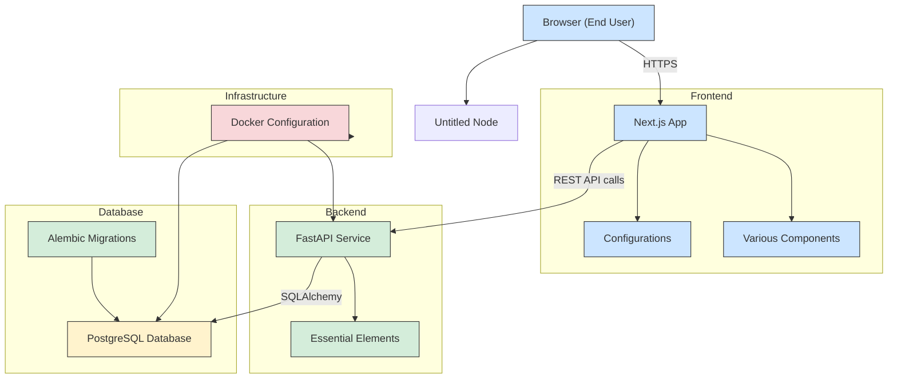

```plaintext
good_ads_backend/
├── app/
│   ├── api/                 # API route handlers (CRUD endpoints)
│   │   ├── v1/
│   │   │   ├── endpoints/
│   │   │   │   └── societies.py
│   │   │   └── __init__.py
│   │   └── __init__.py
│   ├── core/                # Configuration, environment variables
│   │   └── config.py
│   ├── models/              # SQLAlchemy ORM models
│   │   └── society.py
│   ├── schemas/             # Pydantic schemas (request and response models)
│   │   └── society.py
│   ├── crud/                # Database operations (CRUD functions)
│   │   └── society.py
│   ├── db/                  # Database session, connection, migrations
│   │   ├── base.py
│   │   ├── session.py
│   │   └── init_db.py
│   ├── main.py              # FastAPI app instance
│   └── __init__.py
├── alembic/                 # For database migrations
├── tests/                   # Test cases
│   └── test_societies.py
├── .env                     # Environment variables (DB URL, SECRET_KEY, etc.)
├── requirements.txt         # Python dependencies
├── Dockerfile               # (for production dockerizing)
├── docker-compose.yml       # ( using Docker Compose)
└── README.md                # Project documentation
```


| Folder/File      | Purpose                                                         |
| ---------------- | --------------------------------------------------------------- |
| `app/api/`     | All your API routes (endpoints for societies, maybe later auth) |
| `app/core/`    | Configuration: database settings, secret keys, etc.             |
| `app/models/`  | Database ORM models using SQLAlchemy                            |
| `app/schemas/` | Pydantic models for request and response bodies                 |
| `app/crud/`    | Functions that directly interact with the DB                    |
| `app/db/`      | Database session setup and base classes                         |
| `alembic/`     | Auto-manage database migrations                                 |
| `tests/`       | Test cases for APIs                                             |
| `.env`         | Secrets (like DB URL, secret keys, etc.)                        |
| `main.py`      | Launches the FastAPI app                                        |


DB Session management
client -> FastAPI -> Depends(get_db) -> creates session -> uses -> closes after

change that will allow you to create graphs inline using Mermaid syntax, for example:


